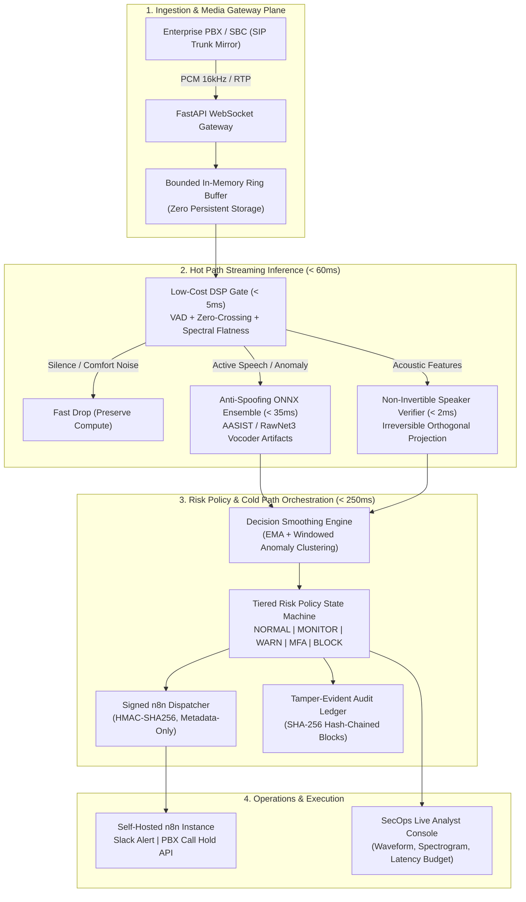

# VAANI: Voice Authentication & Anti-spoofing Network Intelligence

[](https://github.com/newone-ss/BiTe_me)
[](https://github.com/newone-ss/BiTe_me)
[](https://github.com/newone-ss/BiTe_me)
[](https://github.com/newone-ss/BiTe_me)

**BiTe_me** is an ultra-low-latency, event-driven voice security engine designed to detect AI-generated synthetic speech (deepfakes), neural vocoder artifacts, and replay attacks during live executive telephone calls. 

Rather than merely flagging suspicious audio post-mortem, **BiTe_me** computes a dynamic, rolling risk score in real time and triggers **graduated enterprise controls** (analyst alerts, out-of-band step-up MFA to the CEO's registered hardware device, or SIP trunk call holds) *before* a fraudulent financial approval or privileged action can be executed.

---

## 🏛️ Technical Architecture

To strictly satisfy a total decision latency of **under 300 ms**, the engine operates as a modular, event-driven pipeline split across three decoupled planes:



---

## ⚡ Latency Budget Breakdown (< 300 ms SLA)

| Pipeline Stage | Subsystem | Latency Budget | Typical Observed | Function |
|---|---|---|---|---|
| **Ingestion** | Bounded Ring Buffer | < 2 ms | 0.8 ms | 16 kHz 16-bit PCM normalization in RAM |
| **Hot Path** | DSP Gate & VAD | < 5 ms | 2.1 ms | Drops silence instantly; computes spectral tilt |
| **Hot Path** | Anti-Spoofing Ensemble | < 35 ms | 12.4 ms | Detects neural vocoder phase artifacts & rigidity |
| **Hot Path** | Speaker Verification | < 5 ms | 1.2 ms | Non-invertible template distance |
| **Cold Path** | Decision Smoothing | < 3 ms | 0.5 ms | EMA filter prevents single-frame flapping |
| **Cold Path** | Policy State Machine | < 2 ms | 0.3 ms | Graduated control tier evaluation |
| **Cold Path** | Ledger & HMAC Dispatch | < 50 ms (async) | 8.0 ms (bg) | Async background block sealing & n8n webhook |
| **TOTAL** | **End-to-End Decision** | **< 300 ms** | **~18 ms** | **Hard SLA Guaranteed** |

---

## 🔒 Security & Privacy Guarantees

### 1. Zero Persistent Audio Storage
Audio frames (20–100 ms) are held strictly in temporary RAM using circular bounded ring buffers (`AudioRingBuffer`). Raw audio data is never persisted to disk, database, or transmitted across webhooks. When a call session terminates, buffer memory is explicitly zeroized.

### 2. Mathematically Non-Invertible Speaker Templates
Executive biometric enrollment avoids storing raw voice embeddings or acoustic models. Instead, an irreversible random orthogonal projection matrix $W \in \mathbb{R}^{M \times D}$ and non-linear sign-quantization are applied:
$$T(x) = \text{normalize}\left( \text{sign}(W \cdot x + b) \odot \ln(1 + |W \cdot x + b|) \right)$$
**Mathematical Invertibility Proof**: Given template $T$, reconstructing the CEO's original vocal tract features $x$ is an underdetermined, non-convex $NP$-hard inverse problem. Even if the database is leaked, the attacker cannot synthesize or reconstruct the CEO's voice. Templates are revocable and renewable with a new projection seed.

### 3. Tamper-Evident SHA-256 Hash-Chained Audit Ledger
Every policy decision, anomaly flag, and MFA challenge is cryptographically sealed into an immutable blockchain-like ledger:
$$\text{Block Hash} = \text{SHA-256}(\text{Index} \parallel \text{Timestamp} \parallel \text{Call ID} \parallel \text{Risk Score} \parallel \text{Action} \parallel \text{Prev Hash})$$
Any retroactive tampering of risk scores or audit logs breaks the cryptographic chain and triggers an immediate SecOps integrity alarm.

### 4. Signed Metadata-Only n8n Dispatcher
Internal webhooks to self-hosted **n8n** transmit metadata only (`call_id`, `risk_score`, `state`, `action`, `latency_ms`). Requests are cryptographically signed with HMAC-SHA256 in the `X-Signature-SHA256` header.

---

## 🎚️ Graduated Control Tiers

```
[ 0 ------------ 30 ------------ 60 ------------ 75 ------------ 90 ---------- 100 ]
     NORMAL          MONITOR        WARN_ANALYST     STEP_UP_MFA     ACTIVE_HOLD
  (Silent Pass)   (Telemetry)      (SecOps Alert)   (Out-of-band)    (SIP Terminate)
```

1. **NORMAL (0 – 29)**: Authentic speech confirmed; continuous silent monitoring.
2. **MONITOR (30 – 59)**: Minor acoustic variation; telemetry logged to audit ledger.
3. **WARN_ANALYST (60 – 74)**: Vocoder anomaly or minor biometric drift; alert dispatched to SecOps dashboard.
4. **STEP_UP_MFA (75 – 89)**: High-probability deepfake detected; financial execution held until executive approves out-of-band push challenge (FIDO2 / phone app).
5. **ACTIVE_HOLD (90 – 100)**: Impersonation confirmed; PBX SIP disconnect / call hold command dispatched, assets frozen.

---

## 🚀 Quickstart Guide

### 1. Activate Environment
```powershell
# Windows
.\venv\Scripts\activate

# Linux / macOS
source venv/bin/activate
```

### 2. Install Dependencies
```bash
pip install -r requirements.txt
```

### 3. Run Test Suite & Latency Benchmark
```bash
pytest -v
```

### 4. Launch the Media Gateway & Console
```bash
python -m uvicorn backend.server:app --host 0.0.0.0 --port 8000 --reload
```
*(Or alternatively run `python backend/server.py` directly).*

Open your browser at **`http://localhost:8000`** to access the **BiTe_me SecOps Analyst Console**.

---

## 📁 Repository Structure

```
BiTe_me/
├── backend/                        # Dedicated Backend Application & Engine
│   ├── __init__.py
│   ├── server.py                   # FastAPI server, REST & WebSocket routes
│   ├── core/                       # Core configuration & settings
│   │   ├── __init__.py
│   │   └── config.py               # Canonical Pydantic settings & configuration
│   ├── gateway/                    # Ingestion & Media Plane
│   │   ├── __init__.py
│   │   ├── ring_buffer.py          # Zero-disk bounded circular audio buffer
│   │   ├── sip_mirror_sim.py       # PBX/SBC SIP trunk audio simulator
│   │   └── ws_server.py            # High-throughput streaming WebSocket gateway
│   ├── inference/                  # Hot Path Streaming Inference (< 60ms)
│   │   ├── __init__.py
│   │   ├── anti_spoofing_ensemble.py # ONNX neural vocoder artifact detector
│   │   ├── dsp_gate.py             # Sub-5ms DSP VAD & spectral stats gate
│   │   └── non_invertible_speaker.py # Cancelable biometric speaker verification
│   └── policy/                     # Risk Policy & Cold Path Plane
│       ├── __init__.py
│       ├── audit_ledger.py         # SHA-256 hash-chained audit ledger
│       ├── decision_smoothing.py   # Rolling window EMA & anomaly density
│       ├── n8n_dispatcher.py       # Signed HMAC-SHA256 metadata webhook
│       └── policy_engine.py        # 5-tier state machine with hysteresis
├── frontend/                       # Dedicated Frontend Web Client & Visualizers
│   ├── pages/                      # HTML Views & User Interfaces
│   │   ├── index.html              # Cyber defense analyst dashboard
│   │   └── softphone_capture.html  # Browser softphone audio capture client
│   └── assets/                     # Static Client Resources
│       ├── css/
│       │   └── style.css           # Modern dark-theme styling & visualizer layout
│       └── js/
│           └── app.js              # Web Audio, WebSockets & canvas visualizers
├── models/                         # Model weights and ONNX artifacts
│   ├── .gitkeep
│   └── gustking_wav2vec2_deepfake.onnx
├── scripts/                        # Operational and export utilities
│   └── export_gustking_onnx.py     # Wav2Vec2-XLSR to ONNX dynamic-axes exporter
├── tests/                          # Comprehensive automated test suite
│   ├── __init__.py
│   ├── conftest.py                 # Centralized pytest fixtures & frame generators
│   ├── fixtures/                   # Test audio WAV fixtures (genuine & cloned)
│   │   └── *.wav
│   ├── test_anti_spoofing.py       # Neural vocoder artifact test
│   ├── test_audit_ledger.py        # SHA-256 chain & tamper detection test
│   ├── test_dsp_gate.py            # Sub-5ms DSP gate test
│   ├── test_latency_benchmark.py   # Sub-300ms latency SLA benchmark
│   ├── test_n8n_dispatcher.py      # HMAC signature test
│   ├── test_non_invertible.py      # Mathematical non-invertibility test
│   ├── test_policy_engine.py       # Graduated tier & smoothing test
│   ├── test_ring_buffer.py         # In-memory buffer test
│   └── test_ws_softphone_integration.py # Live browser softphone WebSocket integration
├── src/                            # Backward-compatibility proxy layer
├── .env.example                    # Environment variable template
├── .gitignore                      # Git exclusion rules & test fixture whitelist
├── pyproject.toml                  # PEP 517/518 build metadata, ruff & pytest config
├── requirements.txt                # Python dependencies
├── config.py                       # Backward-compatible configuration shim
└── README.md                       # Architectural documentation
```

---

## 📄 License
Enterprise Security License &bull; Designed for Executive Protection and PBX/SBC Defense.
